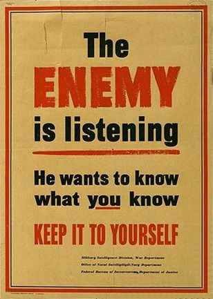
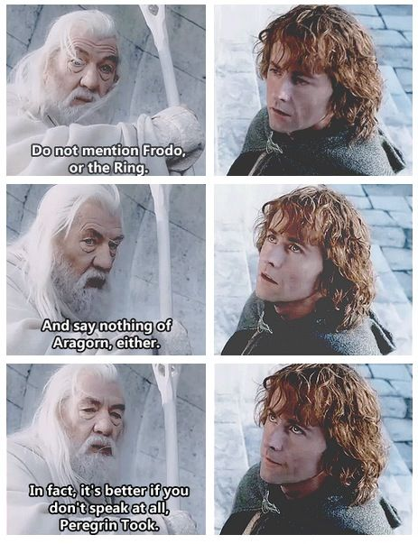
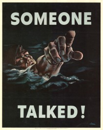
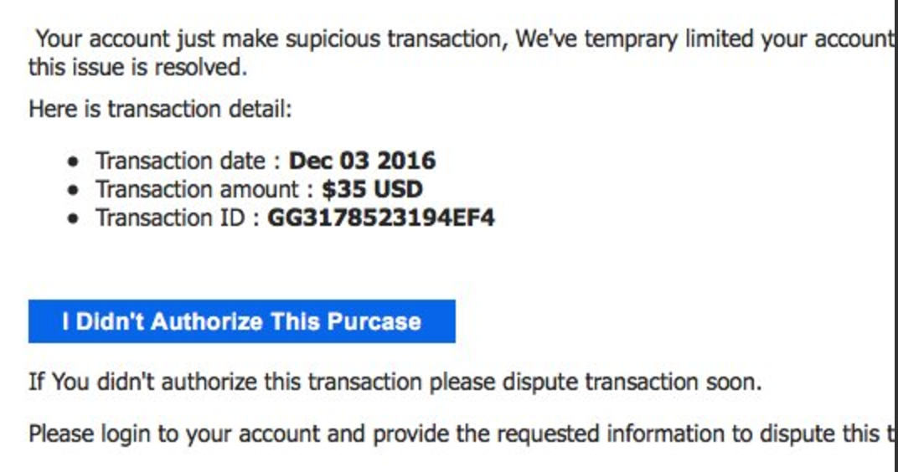
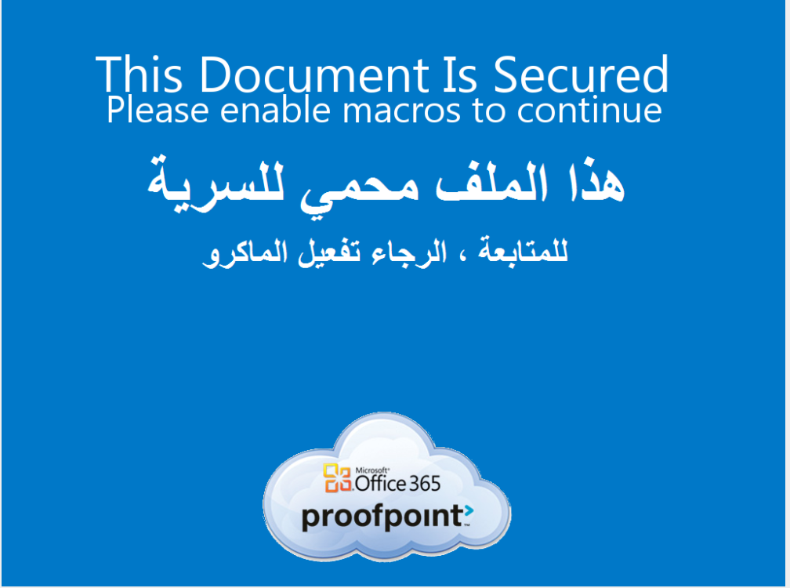
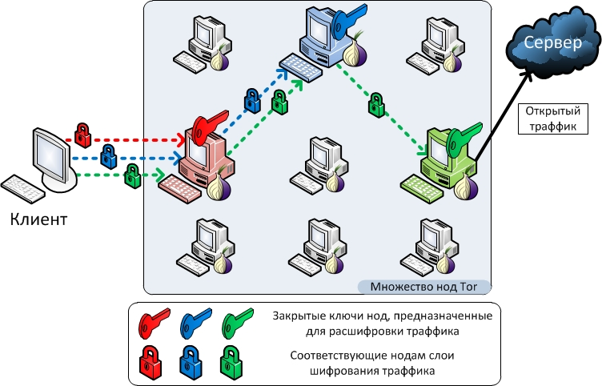
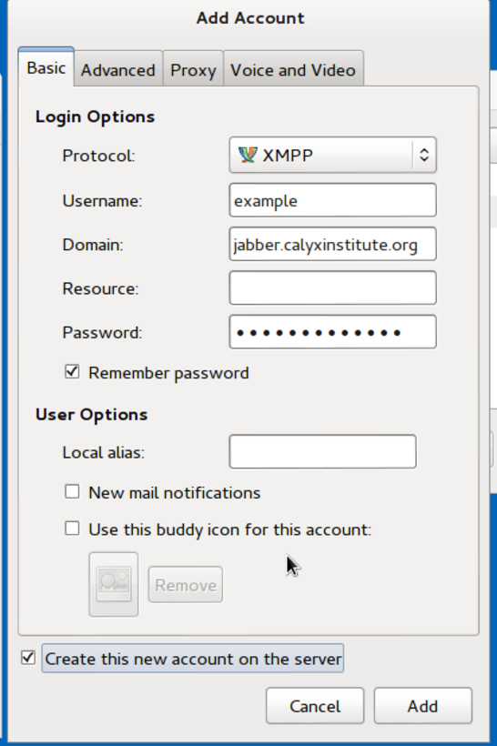

:title: Digital Security fGor Resistors
:author: b_meson
:css: break.css

.. title: Digital Security for Resistors

----

Digital Security for Resistors
==============================

----

$ whoami
========

Freddy Martinez (``@B_meson``), director of (``@LucyParsonsLabs``), FOIA 🤓, hacker, anarchist organizer, operations engineer...  

----

Everyone RN
===========

----

----

Operational Security || Security Culture
========================================

 * Cover 
 * Compartmentalization
 * Concealment

----

Concealment:  keep your plans, capabilities, operators, locations quiet.

----

----

.. image:: images/cops.jpg

Cover: Look like you belong.

----

Compartmentalization: Separate compartments for each area of your life. This can mean a lot of things: separate emails for organizing, different computers / cell phones, 
keeping your direct actions separate from your family life. Example: Twitter account

Rule of Thumb: higher risk --> more vetting --> higher security --> less talking 

----

tl;dr 
=====
Shut the fuck up

----

----

Homework: Allen Dulles 73 Rules
===============================

----

Security consists not only in avoiding big risks. It consists in carrying out daily tasks with painstaking remembrance of the tiny things that security demands. The little things are in many ways more important than the big ones. It is they which oftenest give the game away. 

----

Never set a thing really going, whether it be big or small, before you see it in its details. Do not count on luck. Or only on bad luck.

----

Serious groundwork is much more important than rapid action.

----

Threat Models
=============

 * What information do you have?
 * How are you trying to protect it from?
 * What happens if they find out?

----

.. image:: images/batman.png

----

Threats:
 * CPD -> cellebrite
 * ICE -> deportation
 * Parents -> grounded
 * CTA, PODs, Credit Card History
 * Corporations: Palantir, Pathar, Apple
 * Abusive ex-partners

----

What do We Have to Protect?
 * Living Areas
 * Partners
 * Co-conspirators
 * Sources
 * Physical Location / Identity

----

What Happens if that Gets Disrupted?
 * Raids
 * Arrest
 * Dry Supply
 * Sources dry up
 
**Compartmentalization**

----

----

On to the **digital** security portion of the talk...

----

Basics
======
----

Back up your data! Right now. Do you have multiple backups? Off site?

----

Passwords
=========

----

 * Password managers, LastPass is *free*. 
 * Use a good passphrase for the password manager "OrangeCheetoSilverChariotRamUp4Asses"
 * Passphrase **PROTIP**: intentionally misspell **one word**
 * One password per login, don't go extreme but be rational. (i.e. Spotify != Gmail)

----

MFA
===

 * https://twofactorauth.org/
 * Yubikeys are good, 20 bucks
 * Google Authenticator app
 * Enable rn. 

----

Phishing
========

----

----

Enable Macros
=============

----

----

Fuck. No.
=========

----

Not even once
=============

**Lesson**: stop clicking weird shit from the Internet

----

Virtual Private Networks
========================

VPNs provide one layer of encryption and one "hop" of separation between your physical location and the server you are reaching. 

::

    Before: Me (Comcast IP) -> WebServer
    After: Me (Comcast IP) -> data center ->  WebServer

Note: Your ISP can see you connecting to a VPN.

----

What VPNs are good for:

 * BitTorrent! 
 * OTR (Instant Messaging)
 * Public WiFi
 * Twitter or  browsing pseudo-anonymously

----

What VPNs are bad for:

 * Tracking across multiple services! 
 * Anonymity

----

Don't use Private Internet Access VPN. Mullvad is decent, has mobile client (IKEv2). Accepts cash anonymously. 

----

Tor
===

https://www.torproject.org 

----

----

Tor proxies your request through multiple relays and encrypts / re-encrypts along three hops. 

 * Chat / OTR
 * Web-browsing
 * IRC
 * Email 

System-tor vs TBB 

----

Tor for anonymity but be careful of "fingerprint"ing, a fancy word for tracking across multiple sites. Best practice: close TBB and reopen often.
Be careful of traffic correlation attacks on the network. 

----

Off-The-Record (OTR)
====================

Forward Secrecy. Requires a registered Jabber account.	Install Pidgin or xmpp-client or Adium or ChatSecure (mobile)

----

----

Use Calyx Institute Onion Service `ijeeynrc6x2uy5ob.onion` using the Tor system proxy.

----

Fingerprints: check them **out of band**. One per user per device. 

----

Breakout session?
=================

----

Email?
======
 * Lots of metadata, lots of content, leaks like crazy. 
 * GPG is a nightmare.
 * Private pads are a good idea or use meet.jit.si (pad.riseup.net)

----

Phone Security 
===============	

 * Encrypt the device (iOS has it built in, use a passphrase)
 * Turn *off* fingerprint authentication
 * Signal/WhatsApp
 * Your phone is tracking device and recording device
 * Android is a walking hotbed of malware, generally iOS is more secure. 
 * Put those fucking things away @ demos.

----

.. image: images/telephone.png

----

Signal
======

 * Requires a phone number
 * Google Chrome extension
 * Check codes (QR)
 * Android, encrypt DB

----

Advanced
========

 * QubesOS for targeted malware protection. Tor in VMs via Whonix

----

Random OPSEC tips
=================

 * True anonymity is hard, you may need to register accounts w/ a burner phone. 
 * TING https://www.adafruit.com/products/2505
 * Prepaid gift cards are great for pseudo anonymous use through city. 
 * Patterns of Life must be consistent. 

----

Misc
====
 * https://privnote.com/
 * Signaling is hard, avoid it
 * Avoid gossip
 * Be careful with the drinking...
 * ...and the ego...

----

----

Thanks!
=======

